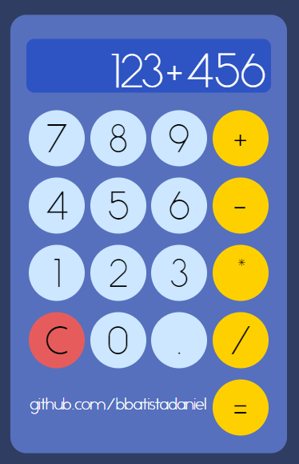

# Web Calculator

Web Calculator is a simple web application that functions as a calculator. It provides a user-friendly interface for performing basic arithmetic operations.

## Features

- **Calculator Interface:** The application offers a clean and intuitive calculator interface for performing calculations.
  
- **Basic Arithmetic Operations:** Users can perform addition, subtraction, multiplication, and division operations.

## How to Use

1. **Enter Numbers:** Click the number buttons (0-9) to enter numerical values.

2. **Perform Operations:** Use the operation buttons (+, -, *, /) to perform arithmetic operations.

3. **Clear Display:** Click the "C" button to clear the display.

4. **Decimal Point:** Use the "." button to input decimal points.

5. **Equalize:** Click the "=" button to calculate and display the result.

## Project Structure

- **HTML (index.html):** Defines the structure of the web page with buttons for numbers and operations.

- **CSS (style.css):** Styles the HTML elements for a visually appealing calculator interface.

- **JavaScript (scripts.js):** Implements the logic for handling user input, performing calculations, and updating the display.

## Requirements

- Web browser

## Usage

1. Clone or download the repository to your local machine.

2. Open the `index.html` file in a web browser.

## Screenshot

## License

This project is open-source and is available under the [MIT License](LICENSE). Feel free to use and modify the code as needed.

## Testing

To experience this project, you can visit the following link: [Web Calculator](https://bbatistadaniel.github.io/WebCalculator/)
